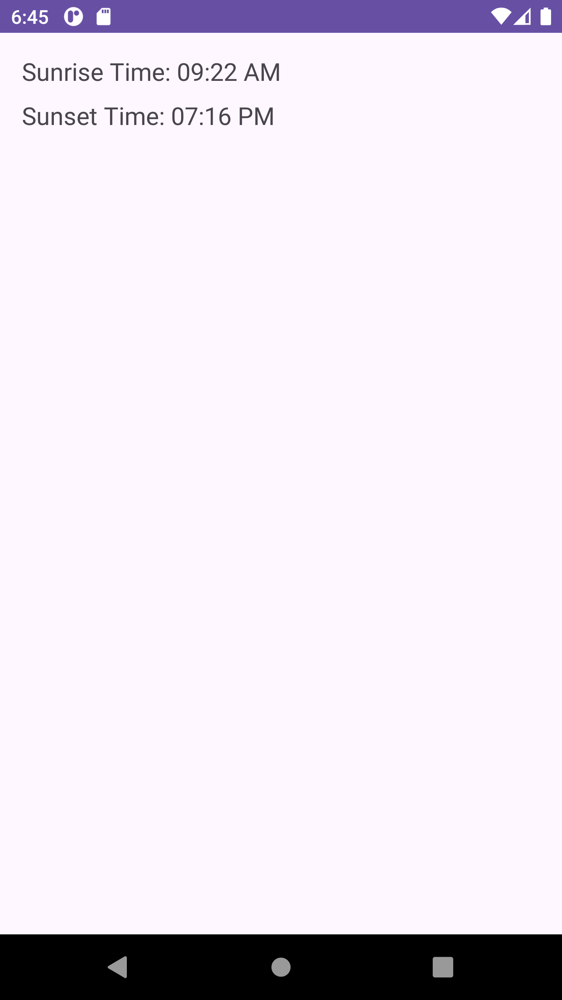
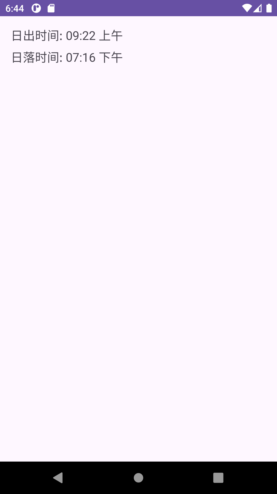
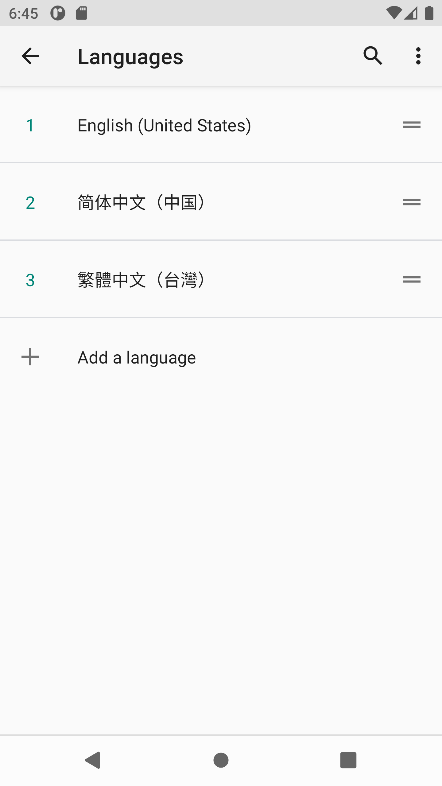

# Sunrise-Set-MDP

## Overview

This Android Kotlin app, titled **Sunrise Set Explorer**, features making an api call and disaplying data based on user language preference.

### Features:

1. Updated the code to retrieve sunrise and sunset times from the API and set them on TextViews using Chinese localization.
2. Utilized the appropriate language code for Chinese.

## App Screens

### English

### Chinese

### Language settings

## Installation
- Clone the repository.
- Open the project in Android Studio.
- Build and run the app on an Android device or emulator.

## Credits
This project was created by Fortune King.
